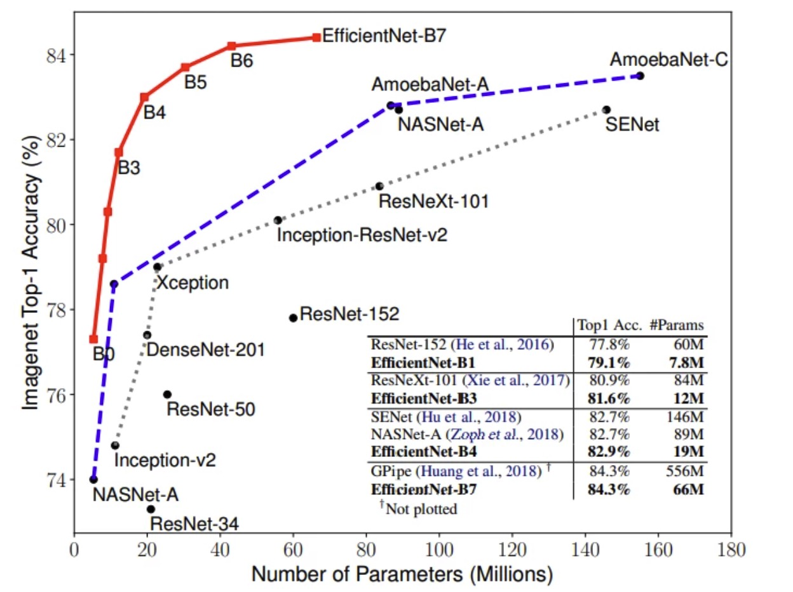
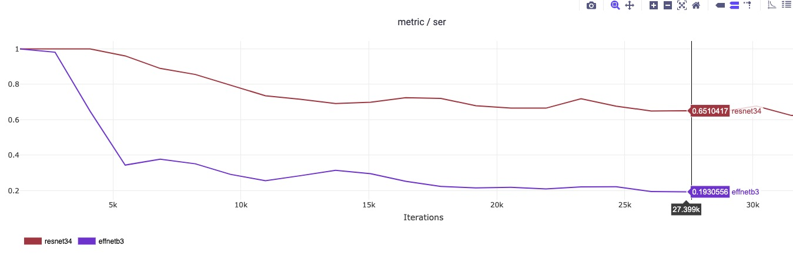
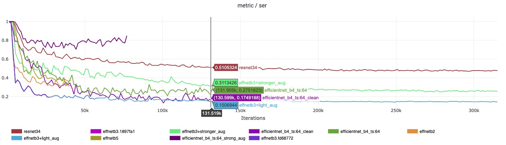

# Распознавание номеров

## Выбор метрики

При распознавании текста существует две основные метрики: CER (character error rate) и accuracy.
В данном проекте рассчитываются метрики CER и SER (sentece error rate) (SER = 1 - accuracy).

CER является нормализованным расстоянием Левенштейна и расчитывается по формуле:
CER = (S + D + I) / N

где

S - кол-во перестановок, D - кол-во удалений, I - вставок символа для получения правильного лейбла, N - длина правильного лейбла.

Хоть CER и является репрезентативной метрикой качества распознавания, целевой метрикой является SER, поскольку отображает процент правильно распознанных номеров от начала до конца.

## Выбор модели
Популярные подходы к решению задачи OCR (Optical Character Recognition):
- Transformer based ([TrOCR](https://arxiv.org/abs/2109.10282), [ViSTR](https://arxiv.org/abs/2105.08582)) + attention decoding
- [CRNN](https://arxiv.org/abs/1507.05717) based + CTC loss
- CNN+transformer + CTC loss ([SVTR](https://arxiv.org/abs/2205.00159))

Модели, основанные на трансформерах, в среднем имеют десятки и сотни миллионы параметров, менее кастомизированные. Также, они имеют преимущество при обработке естественного языка за счет способности языкового моделирования, что не применимо к задаче распознавания номеров машин.

CRNN модели предоставляют широкий выбор кастомизаций CNN и RNN частей.
В качестве экспериментов, зафиксируем в качестве RNN GRU (лейбл короткий, LSTM избыточен) и сравним CNN части: а именно [resnet](https://arxiv.org/abs/1512.03385) и [efficientnet](https://arxiv.org/abs/1905.11946)

сравнение accuracy на imagenet:

сравнение sentese error rate на plates (номера машин, целевой домен):

При этом, семейство моделей efficientnet работают на порядок быстрее аналогинчых CNN.

Также были произведены эксперименты над аугментациями (без, слабые, сильные) и различными версиями efficientnet. [результаты](https://app.clear.ml/projects/28e045ad41b04090b91be8cc33aef8d3/experiments/d54c74b5ebc84c7da8cff2af39330642/execution?columns=selected&columns=type&columns=name&columns=tags&columns=status&columns=project.name&columns=users&columns=started&columns=last_update&columns=last_iteration&columns=parent.name&order=-last_update&filter=)

Наилучшие метрики достигнуты при модели efficientnet-b3 и легкими аугментациями, включащиие шум и контраст.
Часть экспериментов:

CER: 0.035;
SER: 0.144 (accuracy 0.856)